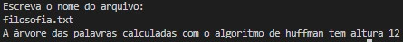

# Huffman_Tree
O problema possui quatro etapas: Ler um arquivo e contabilizar a recorrência das palavras(RP), normalizar a recorrência utilizando a formula -> RP / (max(RP) - min(RP)), criar uma árvore seguindo as regras do algoritmo de Huffman e reescrever um arquivo usando a codificação binária.
# Estrutura
Para leitura do arquivo e normalização utilizamos uma hash, com a biblioteca <unordered_map> com lógica similar à [Open_Hash](https://github.com/Couto1411/Open_Hash), contendo os devidos ajustes para comportar as palavras, suas frequências e suas normalizações de recorrência, então usamos uma árvore derivada de [Tree](https://github.com/Couto1411/Tree_C) para armazenar a tradução das palavras utilizando o algoritmo de huffman e no fim utilizamos uma hash para achar as codificações de cada palavra e reescrever o arquivo.

# Logica

O programa possui alguns métodos importantes: *preencheMap(string nomeArquivo)*, *normalize()*, *createTree(Tree \*\*T)**, *AlturaArvoreLargura(int *altura, Tree \*\*T)* e *writeFile(Tree \*\*T, string nomeArquivo)*.
1) *preencheMap(string nomeArquivo)*:      
Este método é pertencente a uma classe Hash e é responsável por ler de um arquivo com o nome recebido contido na pasta "arquivos". Ele utiliza um tratamento de pontuação e deixa as palavras em minúsculo, então utiliza o unordered_map da classe para setar chaves referentes as palavras e adicionar à um contador presentes nas mesmas.

2) *normalize()*:      
Método presente também na classe Hash que a partir de um unordered_map já preenchido, calcula a recorrência e a insere junto do contador das palavras.

3) *createTree(Tree \*\*T)*:      
Cria uma árvore, criando nós a cada par de menor valores e no final tendo apenas 1 representando a árvore em totalidade, sendo que dados relevantes apenas se apresentam nas folhas.

4) *AlturaArvoreLargura(int *altura, Tree \*\*T)*:       
Preenche um vetor booleano de cada palavra de acordo com o algoritmo de Huffman, mesmo da sessão [Construção da trie de Huffman](https://www.ime.usp.br/~pf/estruturas-de-dados/aulas/huffman.html), sendo apenas as folhas utilizadas

5) *writeFile(Tree \*\*T, string nomeArquivo)*:     
Cria um unordered_map que possui uma string como chave e um vetor de booleanos como valor, e preenche a mesma com as folhas da árvore recebida. Após lê o arquivo original e procura na hash a tradução de cada palavra como vetor booleano.

- O main funciona da seguinte forma:     
    1 - Cria um objeto Hash e um Tree que servirão como armazenamento de dados, para leitura do arquivo e criação da árvore de Huffman;      
    2 - Preenche a Hash criada com as palavras do arquivo;     
    3 - Normaliza a Hash armazenada, armazenando também os valores de recorrência;    
    4 - Preenche a árvore com a Hash com o método *3)*;    
    5 - Codifica cada folha com o código de Huffman de cada uma;    
    6 - Escreve as codificações em um arquivo.     

Obs.:      
- O arquivo "result.txt" deve ser observado para ver a codificação final.

# Exemplo de execução
Nome do arquivo:

> filosofia.txt   
>      
> Caros amigos, a infinita diversidade da realidade única nos obriga à análise do demônio de Laplace. Por outro lado, a complexidade dos estudos efetuados cumpre um papel essencial na formulação da fundamentação metafísica das representações. Assim mesmo, a forma geral da proposição significativa deverá confirmar as consequências decorrentes do sistema de conhecimento geral.
> Neste sentido, o novo modelo estruturalista aqui preconizado auxilia a preparação e a composição das posturas dos filósofos divergentes com relação às atribuições conceituais. Baseando-se nos ensinamentos de Dewey, a canalizaçao do Ser do Ente garante a contribuição de um grupo importante na determinação das novas teorias propostas. A prática cotidiana prova que a consolidação das estruturas psico-lógicas não sistematiza essa relação, de tal modo que a pulsão funciona funciona como significado da determinação do Ser enquanto Ser...

Execução:

	

   

Arquivo "result.txt":
> 0110100111 0001100011 1000101100 0001100110 101111010 11111001001 1110010111 110010100 11100100110 0110101000 1101011001 0100011101 0000111001 1001111111 11011100011 0000111010 11011001011 11101011011 11011101100 11010010111 111011001 11011101010 110011001 1111101111 1101010001 00000001 0111110110 0010010110 11100111000 0001001001 011011000 0001001110 10001000 1111110110 00000001 10100101 11000010 0111000100 010111011 1001110000 0000010010 11011001010 0101100100 0110100101 11110001111 0001111111 1000101010 0101100000 10101100 01100100 11110011110 000000000 11010011101 11010011111 0100100010 0100101110 1000111010 1000010010 11101011010 0100110101 1110101001 101111011 0010110000 0100111110 11010100001 0001000111 0011100000 0000001000 11100110010 11010101011 1000010100 011101101 110011010 10101100 0001101010 10110010 0000101011 1110111101 1110111101 110010001 101111011 0110110110 11110111100 11111110000 0100110110 11111100001 110010001 11110000000 0000101100

# Compilação e Execução

O programa possui um arquivo Makefile que realiza todo o procedimento de compilação e execução. Para tanto, temos as seguintes diretrizes de execução:

| Comando                |  Função                                                                                           |                     
| -----------------------| ------------------------------------------------------------------------------------------------- |
|  `make clean`          | Apaga a última compilação realizada contida na pasta build                                        |
|  `make`                | Executa a compilação do programa utilizando o gcc, e o resultado vai para a pasta build           |
|  `make run`            | Executa o programa da pasta build após a realização da compilação                                 |
